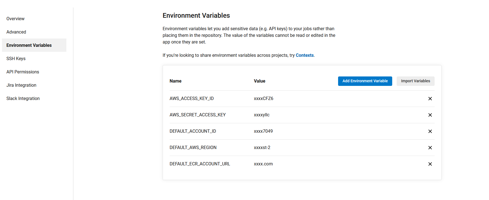

<!-- PROJECT SHIELDS -->
<!--
*** I'm using markdown "reference style" links for readability.
*** Reference links are enclosed in brackets [ ] instead of parentheses ( ).
*** See the bottom of this document for the declaration of the reference variables
*** for contributors-url, forks-url, etc. This is an optional, concise syntax you may use.
*** https://www.markdownguide.org/basic-syntax/#reference-style-links
-->
[![Contributors][contributors-shield]][contributors-url]
[![Forks][forks-shield]][forks-url]
[![Stargazers][stars-shield]][stars-url]
[![Issues][issues-shield]][issues-url]
[![MIT License][license-shield]][license-url]
[![LinkedIn][linkedin-shield]][linkedin-url]
[](https://circleci.com/github/Pakoke/learn-terraform-circleci/?branch=master)


<!-- PROJECT LOGO -->
<br />
<p align="center">
  <a href="https://github.com/Pakoke/learn-terraform-circleci">
    
  </a>

  <h3 align="center">Blue Green Deployment</h3>

  <p align="center">
    This project is going to build our entire infrastructure to deploy an ECS Cluster with a dotnetapi container on it
    <br />
    <a href="https://github.com/Pakoke/learn-terraform-circleci"><strong>Explore the docs »</strong></a>
    <br />
    <br />
    <a href="https://github.com/Pakoke/learn-terraform-circleci#demo">View Demo</a>
    ·
    <a href="https://github.com/Pakoke/learn-terraform-circleci/issues">Report Bug</a>
    ·
    <a href="https://github.com/Pakoke/learn-terraform-circleci/issues">Request Feature</a>
  </p>
</p>


<!-- TABLE OF CONTENTS -->
<details open="open">
  <summary><h2 style="display: inline-block">Table of Contents</h2></summary>
  <ol>
    <li>
      <a href="#about-the-project">About The Project</a>
      <!-- <ul>
        <li><a href="#built-with">Built With</a></li>
      </ul> -->
    </li>
    <li>
      <a href="#getting-started">Getting Started</a>
      <ul>
        <li><a href="#prerequisites">Prerequisites</a></li>
        <li><a href="#installation">Installation</a></li>
      </ul>
    </li>
    <li><a href="#usage">Usage</a></li>
    <li><a href="#roadmap">Roadmap</a></li>
    <li><a href="#contributing">Contributing</a></li>
    <li><a href="#license">License</a></li>
    <li><a href="#contact">Contact</a></li>
    <li><a href="#acknowledgements">Acknowledgements</a></li>
  </ol>
</details>


<!-- ABOUT THE PROJECT -->
## About The Project

This project is about showing how to fully an AWS insfrastructure usingd a Circle pipeline through Terraform, Docker, Dotnet and CircleCI Orbs.
On this project, we are going to build diferents AWS components which it will end up having an ECS cluster with a Dotnet api service on it. In addition to that and thanks to CircleCI, we are going to do a CodeDeploy deployment which it is going to help us deploy the latest version of the code without interrupting the any service of our apps.
At the of this Blue Green deployment, we are going destroy all of our resource in our AWS to save all the cost.

Here's a blank template to get started:
**To avoid retyping too much info. Do a search and replace with your text editor for the following:**
`Pakoke`, `learn-terraform-circleci`, `twitter_handle`, `email`, `project_title`, `project_description`


### Built With

* [Terraform](https://www.terraform.io/)
* [AWS](https://aws.amazon.com/es/)
* [CircleCI](https://circleci.com/)
* [Docker](https://www.docker.com/)
* [Dotnet](https://dotnet.microsoft.com/)

<!-- GETTING STARTED -->
## Getting Started

This project and all the resources will help you to build and deploy the infrastructure. The component deployed are going to be the enough ones to have a fully ECS cluster using EC2 instances using an Autoscaling group.

### Prerequisites

This is what you need to initialize to set your pipeline on CircleCI.
* Git

    Windows
    ```powershell
    choco install git -y
    ```
    Ubuntu
    ```sh
    sudo apt-get update
    sudo apt-get install git -y
    ``` 

* AWS Account
* CircleCI Account
* AWS Client

    Windows
    ```powershell
    choco install awscli -y
    ```
    Ubuntu
    ```sh
    sudo apt-get update
    sudo apt-get install awscli -y
    ``` 

* Terraform

    Windows
    ```powershell
    choco install terraform -y
    ```
    Ubuntu
    ```sh
    sudo wget https://releases.hashicorp.com/terraform/0.14.7/terraform_0.14.7_linux_amd64.zip
    sudo unzip terraform_0.14.7_linux_amd64.zip
    sudo mv terraform /usr/local/bin/
    ```

### Installation

1. Clone the repo
    ```
    git clone https://github.com/Pakoke/learn-terraform-circleci.git
    ```
2. Go to the folder ``infrastructure.init``
    ```
    cd /learn-terraform-circleci/infrastructure.init
    ```
3. Configure your AWS credentials. For the sake of this example, I recommend to create an user with Admin permissions.
    ```
    aws configure
    ```
4. Initialize the Terraform project and apply the plan to get all the information that we will need for set up our pipeline.
    ```
    terraform init
    terraform apply --auto-approve
    ```
5. Get all the outputs that it shows Terraform at the end of plan. You should see something like this
    ```
    AWS_USER_NAME = "xxxx"
    DEFAULT_ACCOUNT_ID = "xxxxxx"
    DEFAULT_AWS_REGION = "xx-xxxx-x"
    DEFAULT_ECR_ACCOUNT_URL = "xxxxx.dkr.ecr.xx-xxxx-x.amazonaws.com"
    S3_TERRAFORM_STATE = "xxxxxxxxxxx"
    ```
6. Open your CircleCI account and import the ``config.yml`` from the folder ``.circleci``. This file is our pipeline on CircleCI, the one that it is going to be on charge of creating all of our resources.
7. As soon as you finish to import the CircleCI pipeline, go to ``Project Settings`` and go to the section ``Environment Variables``. On this section, we need to configure the ones that we have on the image below. The value that we need to put are the ones obtained on the step 5

<a>
    
</a>

8. As you can see, there are two variables that Terraform is not getting for us. Those two variables are sensitive information so in order to obtain those we need to go to AWS Management Console and go the IAM service. On that service we need to go to User and click on the name that Terraform show us on the step 5 ``AWS_USER_NAME = "xxxx"``. After that, you just need generate a ``secret key`` and ``access key`` to finish configuring your CircleCI environments variables.

9. Now there is only one step more to finish the set up of our pipeline. This set up is to configure our Terraform backend and save our state accross steps on our pipeline. To do this, we need to search the files ``version.tf`` and replace the string ``put your s3 bucket`` with the one obtained on the terraform output from the step 5 ``S3_TERRAFORM_STATE = "xxxxxxxxxxx"``. As soon as you finish to replace it, commit your changes and push it. This last action it will automatically push the first pipeline.

<!-- USAGE EXAMPLES -->
## Usage

At this point, you will have your pipeline set up and running without any issue. To see that it is working and you have your entire infrastructure, we need to understand each set of steps to really see that we have everything created.
On our pipeline we are going to have four sections
1. Apply section: This section will consist on apply the main infrastructure which it is going to consist in a ECS cluster, a VPC and an Application Load Balancer. You can test this part going to the terraform step and get the output there. You will see an URL which it is going to return a ``HEALTHY`` message.
Note: CircleCI ofuscate environment variables that's why we see the string ``.*********.``. In this case, that string correspond to the region itself.

<a>
    
</a>
<a>
    
</a>

2. Build and Push image section: This section will handle the creation of our docker image. To do this, we will use an Orb provided by CircleCI to help us build a docker image. This docker image is located inside of our ``apps/dotnetapi/src`` folder. This image is going to update automatically to ECR, our repository of images which later on will be used by our cluster to deploy the app.

<a>
    
</a>

3. Apply Apps section: This part of our deployment will handle the installation of our Target Group and task and services for our ECS Cluster. This will built all the components to connect our app to the load balancer. In addition to that, it will build a CodeDeploy deploy configuration which it is going to managed our BlueGreen deployment for our Apps. In this section, we need to take into account one variable which we will use every time that we push some code. This variable will let Terraform know what of the Target Group of our Balancer is the active.
``
  aws-deploy-status:
    type: string
    default: "blue"
``
This variable can be change on our circleci pipeline configuration so everytime that we are going to do a change on our application we need to change this variable to let Terraform knows on what status it is.

4. Blue Green Deployment section: This step is going execute our Blue Green deployment using CodeDeploy. CodeDeploy is another service of AWS which itis a fully managed deployment service that automates software deployments to a variety of compute services such as Amazon EC2, AWS Fargate, AWS Lambda, and your on-premises servers.

<a>
    
</a>

As soon as it finish, we will see something like the image below. The process is simple, using the two target group and the deployment configuration CodeDeploy itself is going to switch the traffic between those not after deploy our new service into our ECS cluster. After that we will end up having as primary the other Target Group and the other one as a secondary Target Group.

<a>
    
</a>

To test that we are deployment the latest version, we only need to do the next changes.
First, we need to wait until we finish to deploy everything. To know when it finish, we are only going to check the url and the swagger page. If you see the swagger page, we are good to proceed. Then, we need to do the next changes to our code and our pipeline.

On our config.yml, change this variable
```
  aws-deploy-status:
    type: string
    default: "blue" -> "green"
```

On our Dotnet api application, change the next line on the file ``WeatherForecastController.cs`` to the next above.
```
        private static readonly string[] Summaries = new[]
        {
            // Comment the next line and uncomment the next one below            
            // This will help to see how the blue green deployment install the latest code on our ecs cluster
            "Freezing", "Bracing", "Chilly", "Cool", "Mild", "Warm", "Balmy", "Hot", "Sweltering", "Scorching"
            // "Nevado","Caluroso","Nublado","Tormentoso"
        };
```

As soon as you do those two changes, push into our pipeline and approved the steps. When the step blue-green-deployment finish, you will see the changes on our API.
You check specifically the changes, you only need to go to the url ``http://odilo-front-end-892215146.eu-west-2.elb.amazonaws.com/WeatherForecast``

<!-- ROADMAP -->
## Roadmap

See the [open issues](https://github.com/Pakoke/learn-terraform-circleci/issues) for a list of proposed features (and known issues).


<!-- CONTRIBUTING -->
## Contributing

Contributions are what make the open source community such an amazing place to be learn, inspire, and create. Any contributions you make are **greatly appreciated**.

1. Fork the Project
2. Create your Feature Branch (`git checkout -b feature/AmazingFeature`)
3. Commit your Changes (`git commit -m 'Add some AmazingFeature'`)
4. Push to the Branch (`git push origin feature/AmazingFeature`)
5. Open a Pull Request


<!-- LICENSE -->
## License

Distributed under the MIT License. See `LICENSE` for more information.


<!-- CONTACT -->
## Contact

Francisco Javier Ruiz - [@twitter_handle](https://twitter.com/twitter_handle) - email

Project Link: [https://github.com/Pakoke/learn-terraform-circleci](https://github.com/Pakoke/learn-terraform-circleci)


<!-- ACKNOWLEDGEMENTS -->
## Acknowledgements

* []()
* []()
* []()


<!-- MARKDOWN LINKS & IMAGES -->
<!-- https://www.markdownguide.org/basic-syntax/#reference-style-links -->
[contributors-shield]: https://img.shields.io/github/contributors/Pakoke/repo.svg?style=for-the-badge
[contributors-url]: https://github.com/Pakoke/repo/graphs/contributors
[forks-shield]: https://img.shields.io/github/forks/Pakoke/repo.svg?style=for-the-badge
[forks-url]: https://github.com/Pakoke/repo/network/members
[stars-shield]: https://img.shields.io/github/stars/Pakoke/repo.svg?style=for-the-badge
[stars-url]: https://github.com/Pakoke/repo/stargazers
[issues-shield]: https://img.shields.io/github/issues/Pakoke/repo.svg?style=for-the-badge
[issues-url]: https://github.com/Pakoke/repo/issues
[license-shield]: https://img.shields.io/github/license/Pakoke/repo.svg?style=for-the-badge
[license-url]: https://github.com/Pakoke/repo/blob/master/LICENSE.txt
[linkedin-shield]: https://img.shields.io/badge/-LinkedIn-black.svg?style=for-the-badge&logo=linkedin&colorB=555
[linkedin-url]: https://linkedin.com/in/Pakoke
